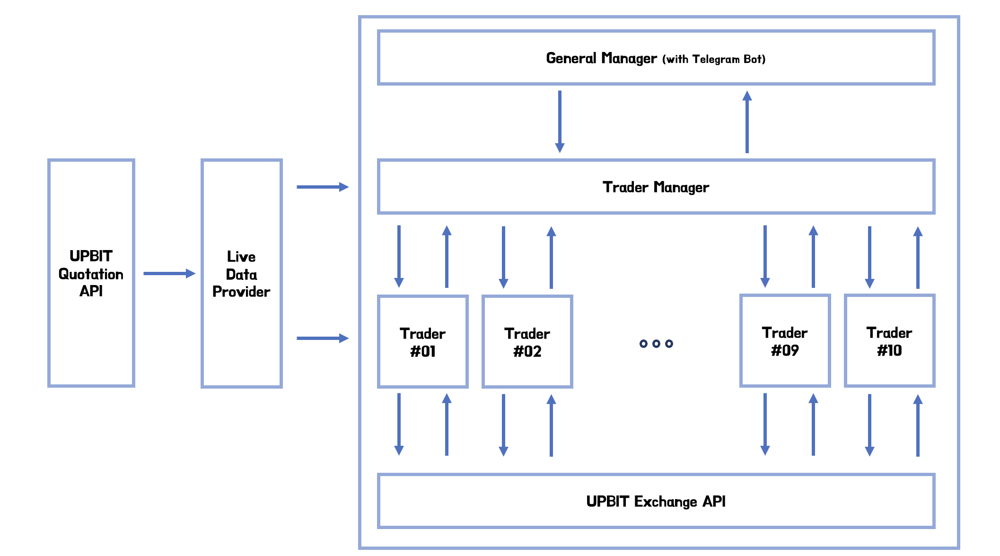
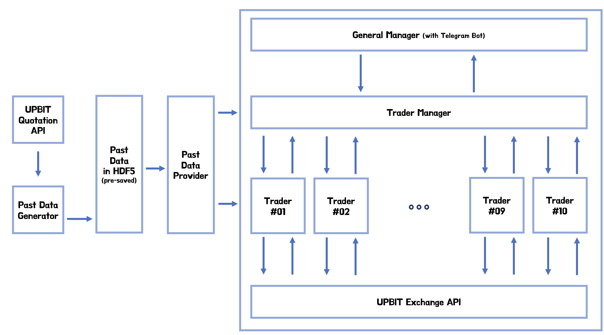

# UPBIT Trader 
### : Algorithmic Trading Bot with RNN (on **UPBIT**)

 

## Introduction
**UPBIT Trader**, is a algorithmic trading bot implemented using non-ML and ML techniques at the same time. Each **Trader** is implemented in traditional methods(non-ML). Famous strategies such as **SMA**(Simple Moving Average), **Momentum**, **Hoffman**, **Contrarian strategy**, etc is used to build each **Trader**. These **Trader**s are managed and governed by the **Trader Manager**, which is implemented using **RNN**. It will receive live data from UPBIT Quotation API and classify the current market. Based on previous training, It will give more weight to **Trader**(s) that have made more profit in similar market situation.

## Architecture - Train Mode

## Architecture - Trade Mode

